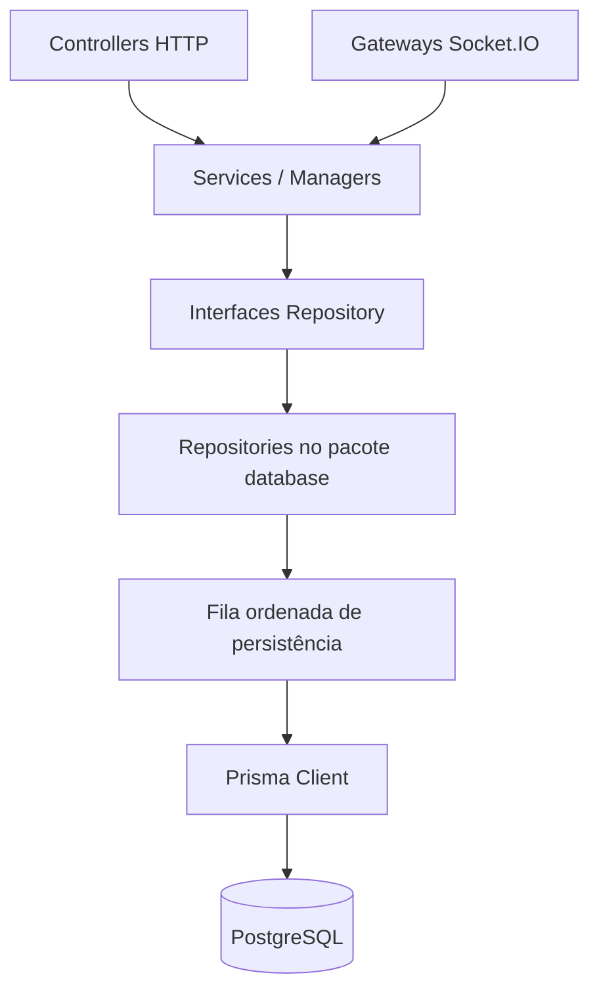
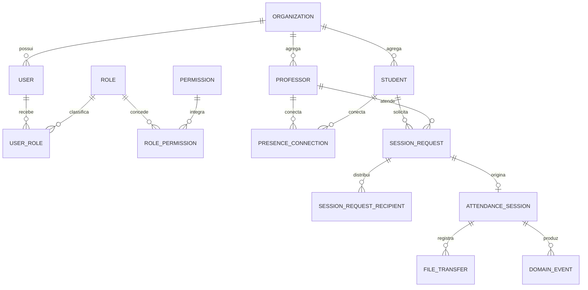
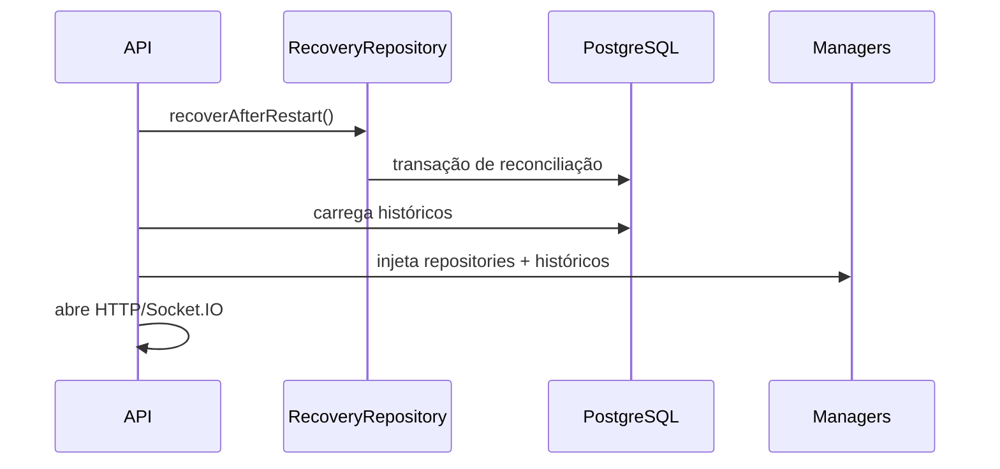

# Arquitetura de persistência

## Dependências

O domínio não importa `@prisma/client`. As interfaces ficam nos pacotes `services` e `websocket`; os adapters concretos ficam em `@professor-connect/database` e são injetados pela API.

## Relacionamentos centrais

## Escrita e consistência

Os contratos Socket.IO existentes são síncronos. Para não mudar a experiência, os adapters enfileiram gravações e as executam sequencialmente. Assim, uma pessoa é criada antes da presença e uma solicitação antes da sessão relacionada. Operações compostas são transações Prisma. `flush()` torna falhas visíveis e é obrigatório no shutdown.

## Inicialização e restart

Conexões de socket não são restauradas, pois deixaram de existir. Elas são marcadas offline. Sessões abertas tornam-se interrompidas e continuam consultáveis no histórico.

## Operação

- Desenvolvimento: `docker compose up --build`.
- Aplicar migrations: `npm run prisma:deploy --workspace=@professor-connect/database`.
- Gerar client: `npm run prisma:generate`.
- Seed: `npm run prisma:seed --workspace=@professor-connect/database`.
- Produção: defina `POSTGRES_PASSWORD` e, quando externo ao Compose, `DATABASE_URL`.

Não registre tokens, senhas, SDP WebRTC, conteúdo de arquivos ou eventos de mouse/teclado em logs/auditoria.
