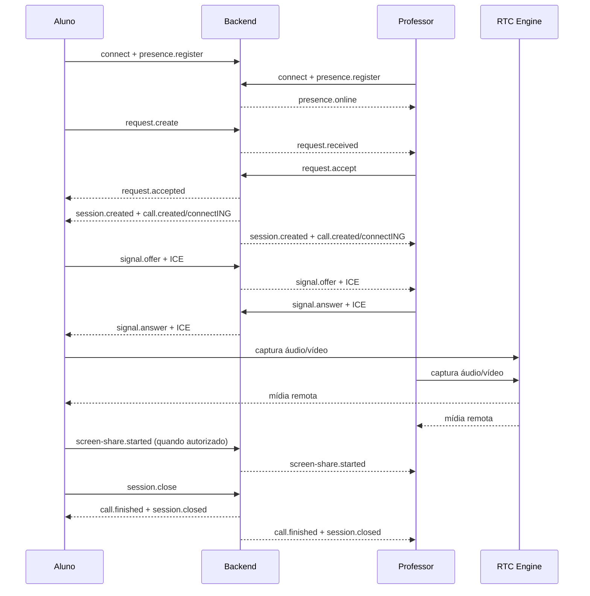

# MVP-3 — Integração ponta a ponta

## Objetivo

O MVP-3 conecta os ciclos já existentes de Presence, Request, Session, Call, Signaling, WebRTC,
áudio, vídeo e compartilhamento de tela em uma única orquestração tipada. A integração não move
responsabilidades dos módulos de origem: o novo manager depende de portas e cada adaptador continua
proprietário de seu transporte ou recurso.

Não fazem parte deste MVP login, persistência, chat, gravação, transferência de arquivos ou execução
de comandos de mouse e teclado.

## Arquitetura

O módulo lógico `client/src/core/integration` reside em
`packages/engine/src/client/core/integration`, pois os dois aplicativos Electron consomem a mesma
engine no monorepo.

```text
Student Electron                         Teacher Electron
       │                                        │
       └──────────── Workflow Manager ──────────┘
                            │
                    EndToEndManager
                            │ portas tipadas
          ┌─────────────────┼──────────────────┐
          │                 │                  │
    Socket.IO/Backend   RTC Engine       Resource Manager
          │                 │                  │
 Presence/Request      WebRTC + mídia     teardown integral
 Session/Call          Screen Sharing
 Signaling
```

Os renderers acessam apenas as APIs de Workflow expostas pelos preloads. Socket.IO, Signaling,
`RTCPeerConnection` e RTC Engine permanecem fora dos componentes visuais.

### Estrutura

```text
packages/engine/src/client/core/integration/
├── end-to-end.manager.ts  # orquestra o atendimento por portas
├── integration.events.ts  # eventos e grafo da State Machine
└── integration.types.ts   # contratos, snapshots e relatório de recursos
```

`EndToEndWorkflowPort` concentra somente operações de alto nível. Isso permite compor os adapters
existentes sem fazer a engine depender de Socket.IO. `EndToEndResourceManagerPort` devolve um
relatório explícito e impede que uma liberação parcial seja tratada como sucesso.

## Fluxo completo



1. Cada cliente conecta e registra Presence.
2. O professor recebe a lista de alunos online.
3. O aluno cria uma Request e o professor recebe a notificação.
4. No aceite, o backend cria automaticamente uma Session ativa apenas com o aluno e o professor
   que aceitou, entra ambos na sala e cria uma Call correlacionada à Session.
5. Signaling encaminha Offer, Answer e ICE somente entre esses dois participantes.
6. RTC Engine cria os peers, captura e entrega áudio/vídeo e mantém o DataChannel.
7. O compartilhamento substitui a track de vídeo e restaura a câmera ao terminar.
8. `session.close` finaliza a Call, encerra a Session, restaura a disponibilidade e inicia a
   liberação local.

## Estados e indicadores

A State Machine integrada usa `DISCONNECTED`, `CONNECTING`, `CONNECTED`, `CALLING`, `PREPARING`,
`IN_ATTENDANCE`, `SHARING`, `RECONNECTING`, `STOPPING` e `FAILED`.

As interfaces apresentam o estado de forma consistente:

| Indicador              | Estado                           |
| ---------------------- | -------------------------------- |
| 🟢 Conectado           | transporte disponível            |
| 🟡 Chamando            | Request pendente                 |
| 🔵 Em atendimento      | Call e mídia ativas              |
| 🟣 Compartilhando tela | captura de tela ativa/solicitada |
| 🔴 Desconectado        | transporte indisponível          |

## Liberação de recursos

O encerramento só é considerado completo quando o relatório inclui todos os recursos abaixo e não
contém falhas:

- `PeerConnection`;
- `MediaStreams`;
- `RTCDataChannel`;
- timers;
- listeners;
- Session;
- Call;
- Requests pendentes.

Uma ausência ou erro move a integração para `FAILED` e publica `integration.failed`. O manager não
silencia liberação parcial.

## Como executar localmente

Pré-requisitos: Node.js 22.12+, npm 10+ e permissão do sistema para câmera, microfone e captura de
tela.

```powershell
npm install
Copy-Item .env.example .env
```

Abra três terminais na raiz:

```powershell
# terminal 1
npm run dev

# terminal 2
npm run desktop:student

# terminal 3
npm run desktop:teacher
```

O backend usa `http://localhost:3000`. Na primeira captura, permita câmera e microfone; na captura
de tela, selecione uma janela ou monitor no seletor do sistema.

## Como validar o fluxo

1. Confirme os indicadores verdes nos dois aplicativos.
2. Verifique se o aluno aparece na lista do professor.
3. Clique em **CHAMAR PROFESSOR** no aluno.
4. Aceite a Request no professor.
5. Confirme Session/Call nos logs e os dois vídeos na área de mídia.
6. Solicite e aceite o compartilhamento de tela.
7. Encerre o atendimento em um dos clientes.
8. Confirme a remoção dos vídeos, o fechamento do canal e o retorno ao estado disponível.

## Dois computadores

1. Coloque as máquinas na mesma rede e libere a porta TCP `3000` no firewall do computador que
   executa o backend.
2. Inicie o backend nesse computador e use seu endereço IPv4 de rede, por exemplo
   `http://192.168.1.20:3000`, na configuração do adapter Socket.IO dos clientes.
3. Execute um aplicativo por computador.
4. Para redes diferentes ou NAT restritivo, habilite TURN pelas variáveis `WEBRTC_TURN_*`; STUN
   sozinho não garante conectividade em todas as redes.
5. Nunca publique a porta de desenvolvimento diretamente na internet; use TLS e um relay TURN
   apropriado fora do ambiente local.

## Testes

```powershell
# orquestração ponta a ponta, WebRTC, mídia, tela, reconexão e recursos
npm run test --workspace=@professor-connect/engine

# fluxo Socket.IO real: Presence, Request, Session, Call e Signaling
npm run test --workspace=@professor-connect/websocket

# apresentações Electron
npm run test --workspace=@professor-connect/student-electron
npm run test --workspace=@professor-connect/teacher-electron

# validação completa do monorepo
npm run check
```

`end-to-end.spec.ts` simula os dois perfis e valida o atendimento completo, a reconexão e a
detecção de teardown incompleto. Os testes do WebSocket sobem um servidor real em porta efêmera e
comprovam a criação automática da Session/Call, Offer, Answer, ICE e encerramento. As suítes do RTC
usam peers reais em Node e tracks de áudio/vídeo de teste.
