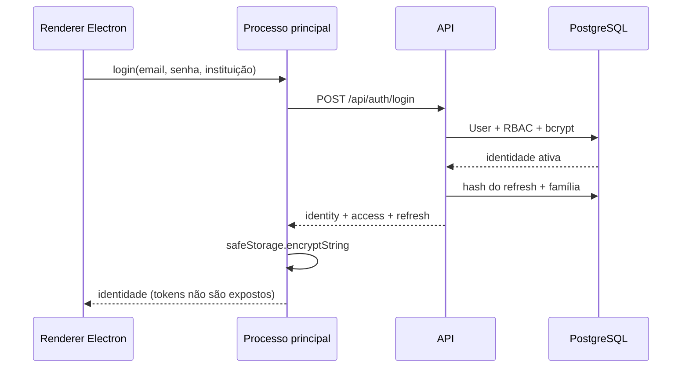
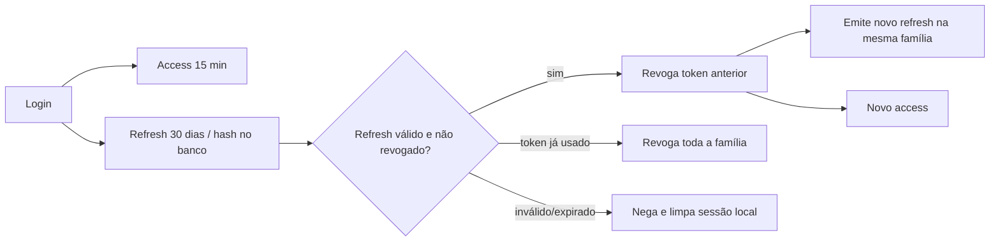
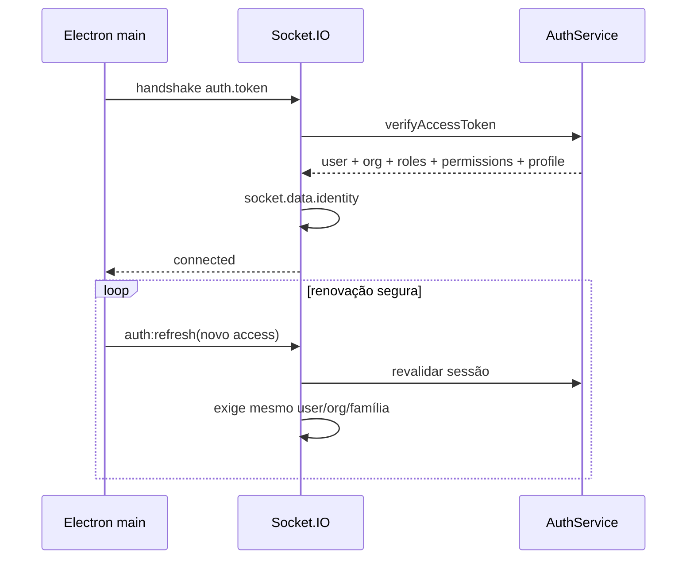
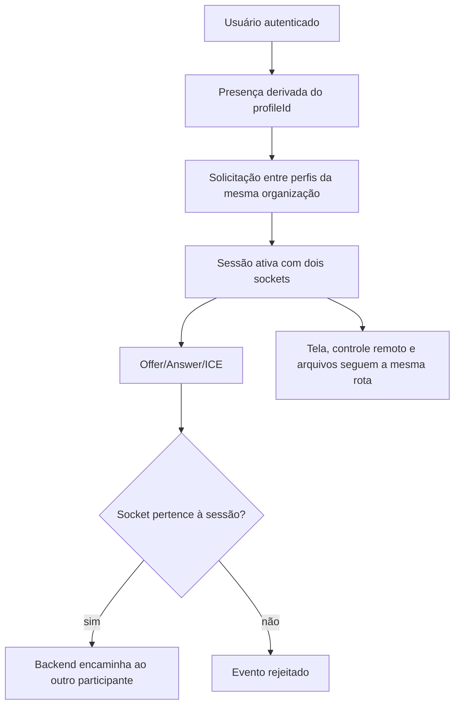
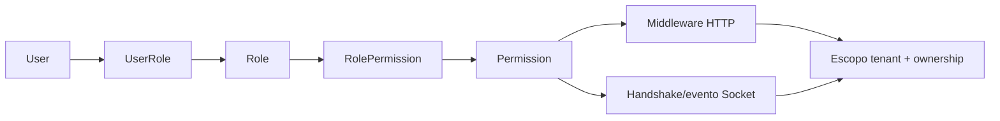

# Sprint BETA-9C — Autenticação, segurança e controle de acesso

## Decisões arquiteturais

1. A identidade canônica é `User`; professor e aluno são perfis 1:1, não identidades paralelas.
2. Todo usuário autenticável pertence a uma `Organization`. Registros e consultas operacionais carregam esse limite de tenant.
3. Access token é curto; refresh token é rotativo e persistido somente por hash. Uma família representa uma sessão simultânea.
4. Papéis agregam permissões. Endpoints e eventos dependem de permissões, evitando condicionais espalhadas por tipo de usuário.
5. O Socket.IO autentica antes de registrar gateways. WebRTC autoriza pelo backend e pelo vínculo do socket à sessão.
6. Google, Microsoft e LDAP aparecem apenas como provedores desabilitados; `ExternalIdentity` permite adicioná-los sem alterar a identidade interna.

## Fluxo de autenticação

## Fluxo JWT e refresh

## Fluxo Socket.IO

## WebRTC autenticado

## Fluxo RBAC

## Matriz inicial

| Capacidade                     | Admin | Professor | Aluno |
| ------------------------------ | :---: | :-------: | :---: |
| conectar Socket.IO             |   ✓   |     ✓     |   ✓   |
| listar professores             |   ✓   |     —     |   ✓   |
| listar alunos                  |   ✓   |     ✓     |   —   |
| solicitar sessão               |   ✓   |     —     |   ✓   |
| responder solicitação          |   ✓   |     ✓     |   —   |
| WebRTC/arquivos                |   ✓   |     ✓     |   ✓   |
| pedir controle remoto          |   ✓   |     ✓     |   —   |
| aprovar controle remoto        |   ✓   |     —     |   ✓   |
| administrar usuários/auditoria |   ✓   |     —     |   —   |

## Compatibilidade

Managers, protocolos de sessão, WebRTC, tela, controle remoto, arquivos, persistência e histórico foram preservados. Os gateways mantêm entradas legadas apenas para testes unitários isolados; o servidor de produção sempre instala autenticação antes deles, portanto payloads do cliente não substituem a identidade autenticada.

Consulte a [auditoria completa](../../auditorias/SPR-BETA-9C-AUDITORIA.md).
